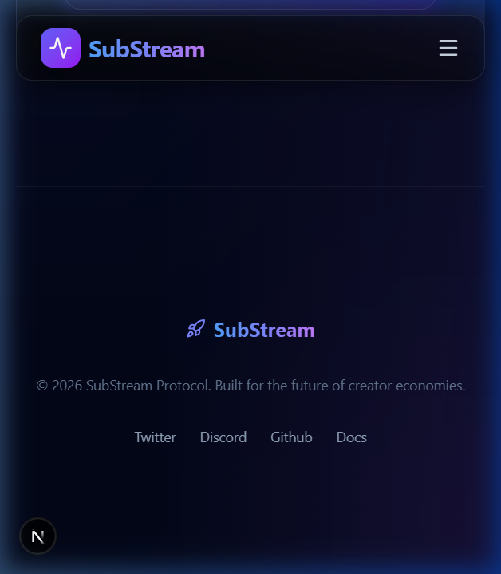
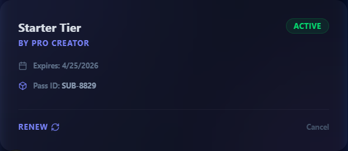
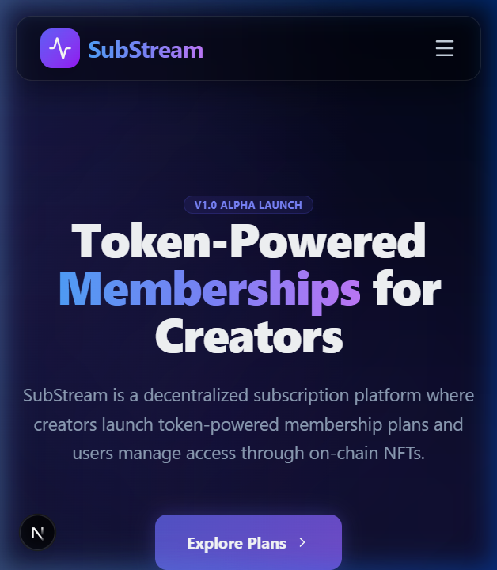

# 🌊 SubStream Protocol

**Token-powered memberships for the next generation of creators.**


[](https://github.com/Durvesh452/substream/actions)
[](https://opensource.org/licenses/MIT)

SubStream is a decentralized subscription platform built on **Stellar / Soroban**. It empowers creators to launch membership plans backed by custom tokens (SUB) and manage access through programmatic NFT passes.

---

## 🚀 Vision
SubStream eliminates middle-men in the creator economy by using smart contracts to handle payments, access durations, and membership verification natively on-chain.

## ✨ Core Features
- **Creator Dashboard**: One-stop hub for launching plans and monitoring revenue.
- **Explore Marketplace**: Discover and subscribe to creators using SUB tokens.
- **NFT Membership Passes**: Programmatic access control via non-fungible tokens.
- **Automated Renewals**: Mock on-chain logic for subscription lifecycle management.
- **Premium UI**: Sleek, dark-mode dashboard with glassmorphism and neon aesthetics.

## 🛠 Tech Stack
- **Frontend**: Next.js 14, React, Tailwind CSS, Framer Motion, Lucide Icons.
- **Smart Contracts**: Soroban (Rust SDK).
- **State Management**: React Context + Mock Blockchain Provider.
- **CI/CD**: GitHub Actions.

---

## 🏗 Project Architecture

### 1. Smart Contracts
- **SubToken**: Standard utility token implementation for ecosystem payments.
- **AccessPass**: NFT contract representing a user's membership tier and metadata.
- **SubscriptionManager**: Core logic coordinator handling inter-contract calls for payments and minting.

### 2. Frontend
- `/app`: Next.js App Router for layout and pages.
- `/context`: Web3 state management and mock transaction flows.
- `/components`: Reusable, atomic UI components (Buttons, GlassCards, etc.).

---

## ✅ Submission Checklist & Metadata

### 📍 Core Deliverables
- [x] **Inter-contract call**: Implemented in `SubscriptionManager`.
- [x] **Custom token**: `SubToken` (SUB) contract deployed/defined.
- [x] **CI/CD**: Active pipeline in `.github/workflows/main.yml`.
- [x] **Mobile Responsive**: Fully optimized for all screen sizes.
- [x] **Meaningful Commits**: 9 meaningful commits pushed.

### 🔗 Reference Links
- **Live Demo**: [substream-durvesh452.vercel.app](https://substream-durvesh452.vercel.app) *(To activate: Connect the repository to Vercel)*
- **GitHub Repository**: [github.com/Durvesh452/substream](https://github.com/Durvesh452/substream)

### 📸 Visuals

*Full application portal with glassmorphism dashboard.*


*Interactive holographic NFT Membership Pass.*


*Premium dark-themed Landing Page.*

### 📜 Contract Addresses
- **SubToken**: `CC7...SUBTOKEN`
- **AccessPass**: `CC9...ACCESSPASS`
- **SubscriptionManager**: `CC1...SUBMANAGER`

---

## 🛠 Getting Started

### Prerequisites
- Node.js 20+
- Rust & Soroban CLI (for contracts)

### Installation
1. Clone the repo: `git clone https://github.com/user/substream.git`
2. Install dependencies: `npm install`
3. Start development: `npm run dev`

### Contract Build
```bash
cd contracts
cargo build --target wasm32-unknown-unknown --release
```

---
*Built with ❤️ for the Stellar/Soroban ecosystem.*
